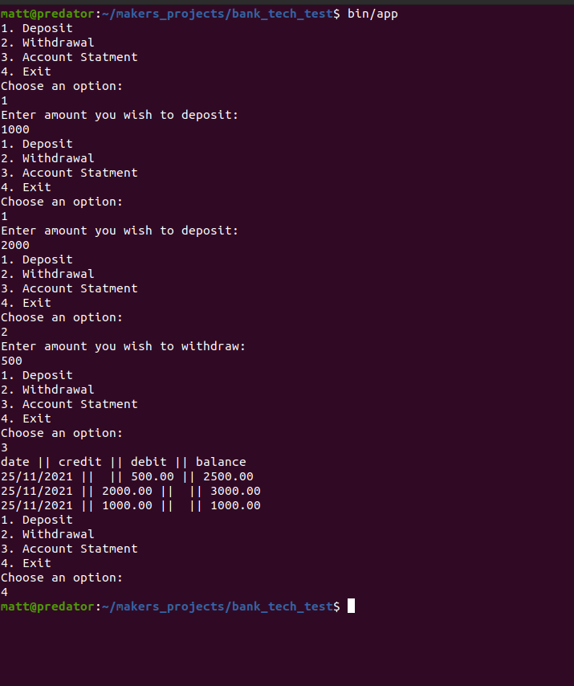

[](https://app.travis-ci.com/Matt-Warnock/bank_tech_test)
[](https://coveralls.io/github/Matt-Warnock/bank_tech_test)
[](https://codeclimate.com/github/Matt-Warnock/bank_tech_test/maintainability)
[](https://depfu.com)


# Readme

# Makers tech test:
A small CLI app that can take deposits and Withdrawals and print bank statements to screen.

## My approach

I decided to build class by class with the most complex class first,
So starting with the user_interface. I had it in mind to do end to end (feature) tests with the action classes, with all other classes being unit tested.

## App design

An Account controller class handles the user request of action and calls the relevant action class. This action class handles the logic of the action, instructing the user interface and the account. To collect and store the transaction.

The menu for actions is displayed after each action, there is a null action used to exit program.



## How to use this project

This is a Ruby project. Tell your Ruby version manager to set your local Ruby version to the one specified in the `Gemfile`.

For example, if you are using [rbenv](https://cbednarski.com/articles/installing-ruby/):

1. Install the right Ruby version:
  ```bash
  rbenv install < VERSION >
  ```
1. Move to the root directory of this project and type:
  ```bash
  rbenv local < VERSION >
  ruby -v
  ```

You will also need to install the `bundler` gem, which will allow you to install the rest of the dependencies listed in the `Gemfile` file of this project.

```bash
gem install bundler
rbenv rehash
```


### Folder structure

* `bin `: Executable files
* `lib `: Source files
* `spec`: Test files


### To initialise the project

```bash
bundle install
```


### To run the app

Make sure that the `bin/app` file has execution permissions:

```bash
chmod +x bin/app
```

Then just type:

```bash
bin/app
```

If this doesn't work you can always do:

```bash
bundle exec ruby bin/app
```

## Tests


### To run all tests


```bash
bundle exec rspec
```


### To run a specific file


```bash
bundle exec rspec path/to/test/file.rb
```


### To run a specific test

```bash
bundle exec rspec path/to/test/file.rb:TESTLINENUMBER
```


### To run rubocop

```bash
bundle exec rubocop
```


### To run all tests and rubocop

```bash
bundle exec rake
```


## License

[](https://opensource.org/licenses/mit)
MIT License
